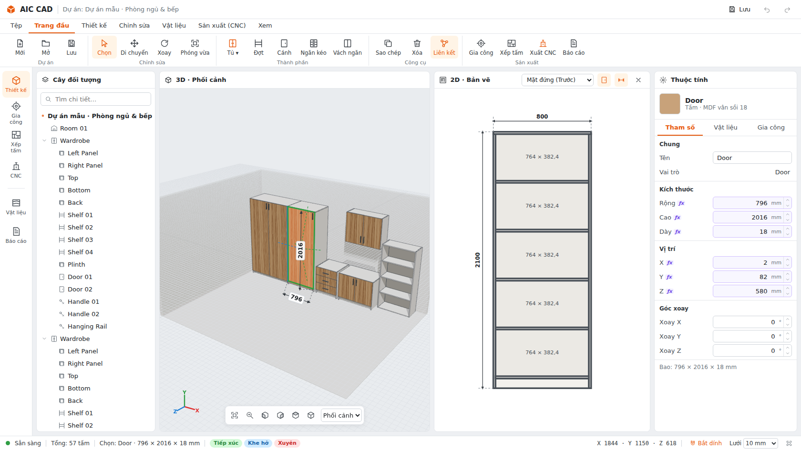

# AIC CAD

Phần mềm thiết kế 3D nội thất gỗ và chuẩn bị dữ liệu CNC.

- **CAD Core** (Rust, Cargo workspace `crates/`): nguồn dữ liệu gốc (source of truth), hình học, quy tắc.
- **UI** (Tauri + React + TypeScript + Three.js + Vite, thư mục `app/`): chỉ tương tác và hiển thị.

```text
UI (React/Three.js) ──Request JSON──▶ AIC API (Engine::dispatch) ──▶ Domain / Parametric / Assembly ──▶ Geometry kernel
        ▲                                        │
        └──────────── Response + CoreEvents ◀────┘   (Tauri IPC trên desktop, HTTP dev server trên trình duyệt)
```



## Chạy thử

Yêu cầu: Rust stable, Node 20+ (có C++ compiler để build Clipper2).

```bash
# 1. Lõi CAD (HTTP bridge cho trình duyệt), cổng 8787
cargo run -p aic-dev-server --release

# 2. Giao diện, http://localhost:5173 (proxy /api → 8787)
cd app && npm install && npm run dev
```

Lần đầu mở, app tự tạo **dự án mẫu** (phòng + tủ áo, tủ bếp, tủ ngăn kéo, kệ).

Desktop (Tauri 2, cần WebKitGTK trên Linux):

```bash
cd app && npm install && npx tauri dev     # hoặc: npx tauri build
```

Bản chạy một tiến trình (phục vụ luôn frontend đã build):

```bash
cd app && npm run build && cd ..
AIC_STATIC=app/dist cargo run -p aic-dev-server --release   # mở http://127.0.0.1:8787
```

## Kiểm thử

```bash
cargo test --workspace              # unit + integration test của core
cargo clippy --workspace --all-targets
cd app && npm test && npm run typecheck
```

Các test bắt buộc trong đặc tả đều có:

| Yêu cầu | Test |
|---|---|
| Panel 600×500×18 → thể tích chính xác | `aic-geometry` `csg::tests::panel_600x500x18_volume_is_exact` |
| Tấm chạm nhau → TOUCH | `aic-assembly` `touching_panels_is_touch` |
| Hở 2 mm → GAP = 2 | `aic-assembly` `two_mm_clearance_is_gap_2` |
| Xuyên 10 mm → PENETRATE = 10 | `aic-assembly` `ten_mm_penetration_is_penetrate_10` |
| Đổi tham số → kích thước phụ thuộc cập nhật | `aic-parametric` `dependent_dimensions_update`, `aic-project` `cabinet_generation_and_parameter_update` |
| save → load → dữ liệu giống hệt | `aic-project` `save_load_identical` |

## Cấu trúc

```text
crates/
  aic-math           Transform3D (không scale), AABB/OBB, Polygon2D
  aic-domain         Panel, Cabinet, Hardware, Room, Material, MachiningFeature, Scene graph, cabinet generators
  aic-parametric     Parser biểu thức an toàn + dependency graph (cycle, dirty, incremental, constraint)
  aic-geometry       Trait GeometryKernel + CsgKernel (BSP, Rust thuần) + builder tấm/phụ kiện/phòng
  aic-spatial        Sort-and-sweep broad phase, SAT hộp–hộp, snap
  aic-assembly       AssemblyRelation (TOUCH/GAP/PENETRATE …), lưu một chiều, chiều ngược suy ra
  aic-manufacturing  Feature suy diễn (bản lề, chốt gỗ, chốt đợt), flatten 3D→2D, Clipper2, toolpath + G-code
  aic-nesting        Interface NestingPart/NestingPlacement + MaxRects nester
  aic-project        Document, Command (execute → inverse), History, định dạng file có version + migration
  aic-api            Engine: Request/Response/CoreEvent, render objects, properties, relations, nesting, CNC
  aic-dev-server     HTTP bridge (POST /api) cho trình duyệt
app/
  src/core-api       transport (Tauri IPC | fetch), commands, queries, events, errors (thông báo tiếng Việt)
  src/viewport       renderer, geometry cache, materials, gizmo, overlays (kích thước, snap, quan hệ, handle)
  src/features       scene-tree, properties, drawing2d, manufacturing, nesting, cnc, materials, report
  src/app            khung ứng dụng: ribbon, rail, status bar, shortcut layer, context menu
  src-tauri          vỏ desktop: một lệnh IPC `dispatch`
docs/                ADR, bảng ánh xạ API, phím tắt, checklist kiểm thử, ảnh chụp
```

## Tiến độ theo phase

Core: Phase 1–6 xong; Phase 7 (tối ưu, test dự án lớn) mới một phần. UI: Phase 1–6 xong. Chi tiết và việc còn lại
xem [docs/STATUS.md](docs/STATUS.md).
