# Hướng dẫn dựng tủ từng bước

Tài liệu này đi theo đúng thứ tự thao tác khi dựng một dự án nội thất gỗ:
**Dự án → Tầng → Phòng → Tủ (Khung) → Tạo tấm → Chỉnh tấm → Tool → Báo cáo → Sản xuất**.

Chạy chương trình:

```bash
cargo run -p aic-dev-server --release   # core, cổng 8787
cd app && npm run dev                   # giao diện, http://localhost:5173
```

Bố cục màn hình:
- **Trái**: *Cây đối tượng* (tầng, phòng, tủ, tấm) và tab *Tool*.
- **Giữa**: 3D phối cảnh và 2D bản vẽ.
- **Phải**: bảng thiết kế với các tab *Khung · Tạo tấm · Chỉnh tấm · Quản lý · Thư viện · Cài đặt*.

---

## 1. Chia dự án theo tầng và phòng

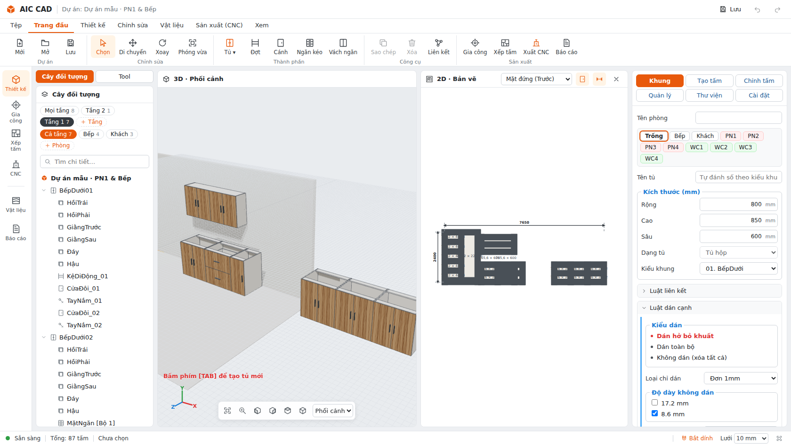

Một dự án gồm nhiều **tầng**, mỗi tầng có nhiều **phòng**, mỗi phòng có nhiều **tủ**.
Hai hàng tab ở đầu *Cây đối tượng* dùng để chọn tầng và phòng.

| Thao tác | Kết quả |
|---|---|
| **+ Chia tầng** (lần đầu) | Tạo "Tầng 1" và bật hàng tab tầng. |
| **+ Tầng** | Thêm tầng mới (Tầng 2, Tầng 3, Tầng 4…). Tầng mới có khu đặt tủ riêng, cách các tầng khác 3 m trên mặt bằng. |
| Bấm một tab tầng | Chỉ hiện tủ của tầng đó (cây, 3D, 2D) và camera tự căn khung nhìn. Hàng dưới chỉ liệt kê phòng của tầng này. |
| **+ Phòng** | Thêm phòng vào tầng đang chọn, ví dụ Bếp, Khách, PN1, WC1. |
| Bấm một tab phòng | Chỉ hiện tủ của phòng đó. Tủ tạo mới sẽ vào đúng phòng này. |
| Bấm đúp một tab | Đổi tên tầng/phòng: mọi tủ bên trong được chuyển theo, Ctrl+Z hoàn tác được. |
| **Mọi tầng / Tất cả / Cả tầng** | Bỏ lọc. |

Số nhỏ cạnh tên tab là số tủ đang có. Có thể chuyển một tủ sang tầng hoặc phòng khác bằng cách sửa ô **Tầng**
hoặc **Tên phòng** ở tab *Chỉnh tấm* khi đang chọn tủ đó.

## 2. Tạo tủ (tab Khung)

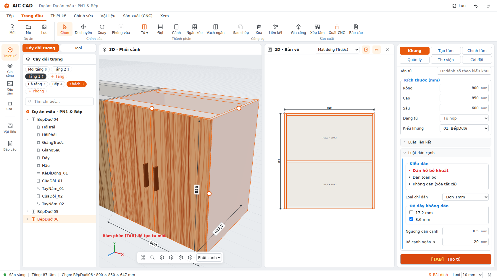

1. Chọn tầng và phòng ở cây bên trái. Chip phòng trong form cũng đổi được phòng.
2. Tab **Khung → Thông tin tủ**:
   - *Tên tủ*: để trống thì tự đánh số theo kiểu khung (BếpDưới01, TủQA01…).
   - *Kích thước*: Rộng, Cao, Sâu.
   - *Dạng tủ*.
   - *Kiểu khung*: 01 BếpDưới … 06.
3. **Luật liên kết**:
   - Nóc: phủ bì, lọt lòng hoặc giằng.
   - Đáy.
   - Độ sâu rãnh hậu: 0 là hậu lọt, 13 là hậu âm rãnh.
4. **Luật dán cạnh**:
   - Dán hở bỏ khuất, Dán toàn bộ hoặc Không dán.
   - Loại chỉ: mặc định Đơn 1mm.
   - Độ dày không dán: mặc định bỏ 8.6.
   - Ngưỡng dán cạnh và bỏ cạnh ngắn.
5. Bấm **[TAB] Tạo tủ** (hoặc phím TAB).
   - Nếu đang chọn một tủ cùng phòng, tủ mới được đặt **nối tiếp bên phải** tủ đó, dùng để tạo dãy tủ bếp.
   - Nếu không, tủ nối tiếp dãy của phòng. Phòng trống thì tủ được đặt ở một khu mới.

Thông số mặc định: ván 17.2, hậu 8.6, rãnh 13, chỉ Đơn 1mm.

## 3. Dựng chi tiết bên trong (tab Tạo tấm)

### 3.1 Ghim vùng
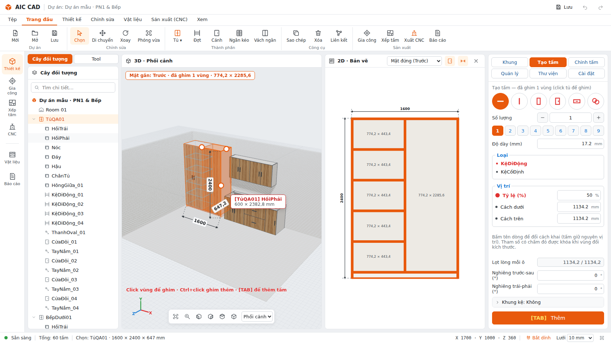

1. Bấm vào tủ để chọn tủ.
2. Mở tab **Tạo tấm**. Các **vùng** (khoảng trống giữa các tấm) hiện ra, kèm kích thước lọt lòng.
3. Ghim vùng:
   - **Click một vùng** để ghim vùng đó.
   - **Ctrl+click** để ghim thêm vùng khác, áp một thao tác cho nhiều vùng cùng lúc.
   - Phím **~** bật/tắt hiện vùng, **Alt+~** cô lập tủ.

### 3.2 Dựng nhanh bằng chuột phải
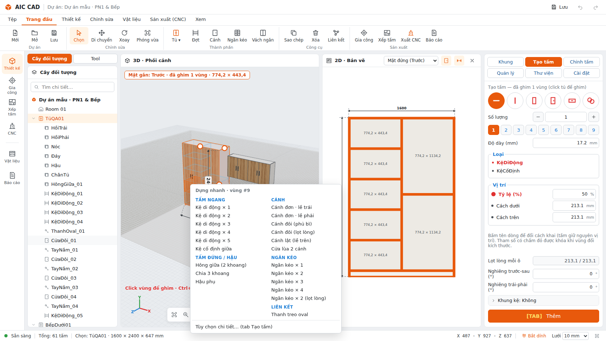

**Chuột phải vào một vùng** để mở menu *Dựng nhanh*. Chọn một mục là dựng xong ngay, không phải điền form:

| Nhóm | Lựa chọn |
|---|---|
| Tấm ngang | Kệ di động ×1…×5 (chia đều), Kệ cố định giữa |
| Tấm đứng / hậu | Hông giữa (2 khoang), Chia 3 khoang, Hậu phụ |
| Ngăn kéo đặc biệt | **Ngăn kéo trong × 2 (sau cánh)**: mặt lọt lòng lùi 25 mm sau cánh, không tay nắm, ray ngắn lại theo phần lùi (dùng cho khoang con dưới cánh tủ áo — chia khoang Tạo tấm = Không trước). **Mặt giả (tủ chậu)**: chỉ có mặt ngăn cố định, không hộc / ray / tay nắm |
| Cánh | Cánh đơn lề trái/phải, Cánh đôi phủ bì/lọt lòng, Cánh lật (lề trên), Cửa lùa 2 cánh |
| Ngăn kéo | ×1…×4 phủ bì, ×2 lọt lòng (tự có hộc + ray bi theo chiều sâu) |
| Liên kết | Thanh treo oval |

Mục cuối, *Tùy chọn chi tiết…*, mở form đầy đủ ở mục 3.3.

### 3.3 Dựng bằng form
Sáu nút tròn ở đầu tab lần lượt là: Tấm ngang, Tấm đứng, Hậu, Cánh, Ngăn kéo, Liên kết.

- **Tấm ngang / đứng / hậu**:
  - Số lượng (1–9).
  - Độ dày.
  - Loại: kệ di động (tự khoan chốt tầng) hoặc kệ cố định.
  - **Vị trí** với chấm đỏ = tham số bị khóa:
    - *Tỷ lệ (%)*: giữ tỷ lệ khi tủ đổi kích thước.
    - *Cách dưới* hoặc *Cách trên*: giữ khoảng cách cố định.
  - Nghiêng.
  - Khung kệ.
- **Cánh**:
  - Số cột × hàng.
  - Đơn, Đôi hoặc Lùa.
  - Phủ bì hoặc lọt lòng.
  - Lắp lề.
  - Thanh chặn: chữ L hoặc thẳng, với cao, che lên, chân, lùi.
- **Ngăn kéo**:
  - Số tầng, số cột, phủ bì hoặc lọt lòng.
  - Hộc: khe hở, độ dày thành, đáy.
  - Khoảng hở ray.
- **Liên kết**: thanh oval, cách trên. Danh sách liên kết đã áp có nút × để xóa.

Bấm **[TAB] Thêm** để áp vào các vùng đang ghim.

## 4. Chỉnh chi tiết (tab Chỉnh tấm)
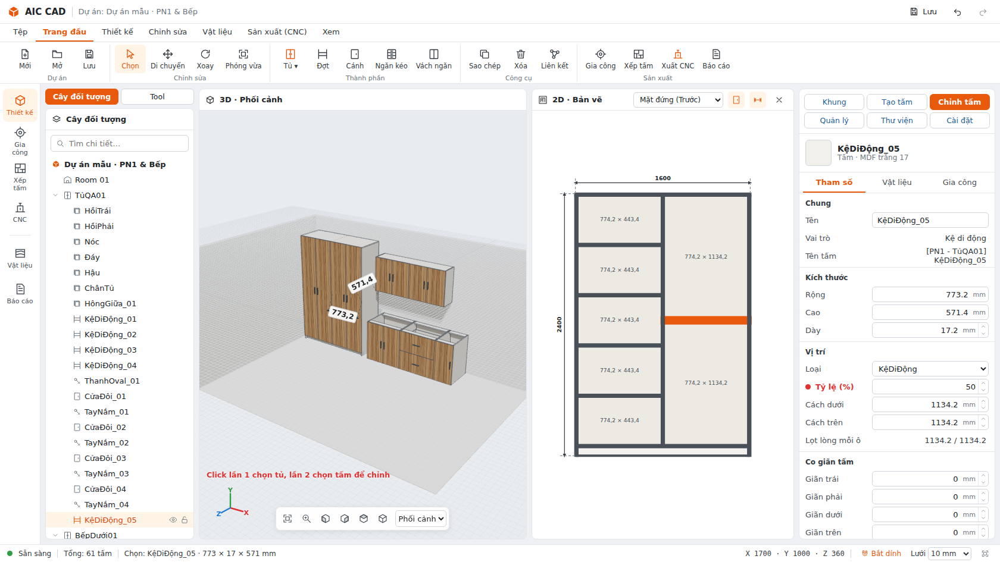

Click một tấm, rồi mở tab **Chỉnh tấm**:
- **Vị trí**: bấm tên dòng (Tỷ lệ / Cách dưới / Cách trên) để đổi cách khóa. Tấm giữ nguyên vị trí; tham số có chấm đỏ được giữ khi vùng đổi kích thước.
- **Co giãn** 4 cạnh (mm): kéo dài hoặc thu ngắn tấm.
- Độ dày, vật liệu, tên, dán cạnh từng cạnh.
- Cánh / ngăn kéo: lề, phủ/lọt, khe giữa cánh, **khe từng phía** (trái/phải/dưới/trên), thanh chặn.

- **Offset (lùi mặt)**: lùi mặt trước/sau/trái/phải/trên/dưới theo hướng tủ (ví dụ kệ lùi trước 30). Lưu thành tham số, tủ đổi kích thước vẫn giữ.
- **Ràng buộc (bám mặt tấm khác)**: chọn cạnh (trái/phải/dưới/trên) → tấm đích → mặt trong/ngoài → offset → *Thêm*.
  Ví dụ: kệ *Cạnh phải → Hồi phải · mặt trong · 0*: hồi phải dịch vào (Lùi phải 30) thì kệ tự ngắn lại 30. Mỗi cạnh một
  ràng buộc; nút × để bỏ.
- **Neo rộng / cao / sâu** (khi chọn tủ): giữ trái/giữa/phải… khi đổi kích thước.

**Chọn nhiều tấm** (Ctrl+click trên cây, 3D hoặc 2D): tab Chỉnh tấm hiện các thông số chung; ô có giá trị khác nhau hiện
"Nhiều giá trị". Sửa một lần áp cho tất cả, Ctrl+Z hoàn tác cả nhóm. Bảng bên phải tự chuyển tab: chọn tấm → Chỉnh tấm,
ghim vùng → Tạo tấm.

**Chuột phải vào một tấm** để thao tác nhanh:
- Đổi kệ di động ↔ cố định.
- Căn giữa vùng (50%).
- Chia đều lại.
- Co giãn trên ±20.
- Mở Chỉnh tấm.

## 4b. Sửa trực tiếp trên bản vẽ 2D
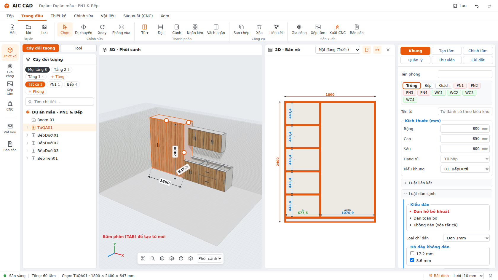

Chọn một tủ. Ở **Mặt đứng (Trước)**, bản vẽ 2D trở thành trình chỉnh sửa:

| Thao tác | Kết quả |
|---|---|
| Bấm số **W / H** màu cam | Nhập kích thước tủ mới (Enter). Tủ giữ vị trí theo **Neo** (Chỉnh tấm → Neo rộng: Giữ trái / giữa / phải). Các tủ **đứng liền trong cùng dãy** (cùng cao độ, cùng hướng) tự dịch theo để dãy luôn khít; tủ trên, tủ đặt cách khe không bị ảnh hưởng. |
| Bấm số kích thước khoang | Nhập mm → khoang thành **KHÓA**; nhập `40%` → khoang thành **%**. |
| Bấm nhãn **KHÓA / % / AUTO** trên số | Đổi chế độ khoang: **KHÓA** giữ mm · **%** giữ tỉ lệ · **AUTO** chia phần còn lại. Ví dụ `600 KHÓA · AUTO · 400 KHÓA`: tủ 1600 → 1800 thì chỉ khoang giữa tăng 200. |
| Kéo vách / kệ | Xem trước số đo 2 khoang kề khi kéo; thả chuột mới lưu. Tự bắt điểm chia đều; giữ **Shift** để bước 10 mm. Chỉ 2 khoang kề thay đổi. |
| Click vùng trống | Ghim vùng (Ctrl+click ghim thêm). **Chuột phải** → Dựng nhanh, Chia ngang/dọc 2–4 khoang, Chia đều lại. |

| Số cao ngăn kéo (bên phải chồng ngăn) | Nhập mm / `%`, bấm nhãn để đổi KHÓA / % / AUTO; kéo khe giữa 2 ngăn để chia lại. |

Màu số: xanh dương = AUTO, đỏ = KHÓA, xanh lá = %. Nếu thay đổi làm một khoang nhỏ hơn 1 mm, phần mềm từ chối và giữ nguyên.

## 4c. Template, rule preset, lật gương, nhân dãy
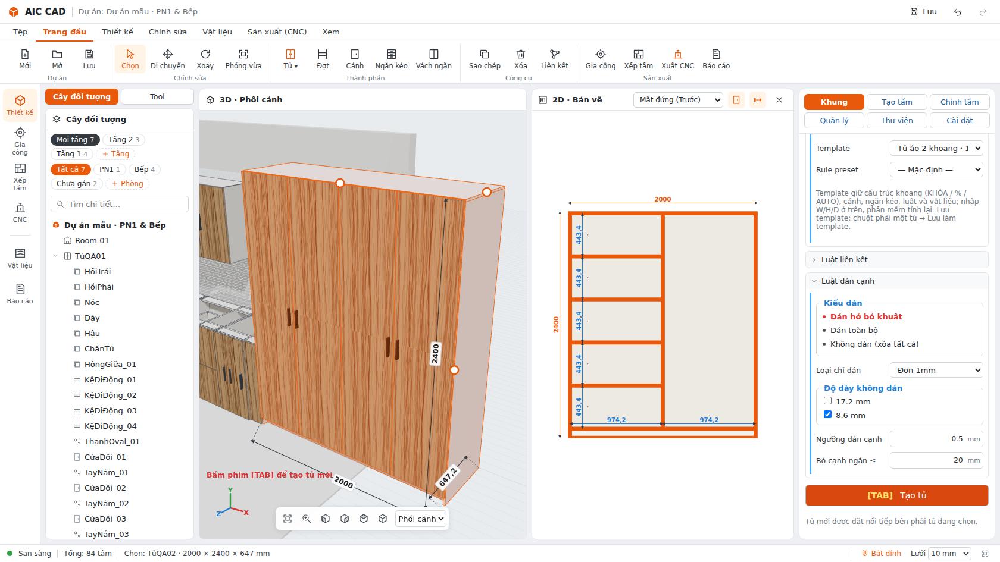

- **Lưu template**: chuột phải tủ → *Lưu làm template…* (hoặc Cài đặt → Template tủ). Template lưu cấu trúc logic:
  khoang KHÓA / % / AUTO, cánh, ngăn kéo, luật liên kết, dán cạnh, vật liệu.
- **Chèn template**: tab Khung → *Template & Rule preset* → chọn template, nhập W/H/D → **[TAB] Tạo tủ**. Phần mềm tính
  lại: khoang KHÓA giữ mm, khoang AUTO lấy phần còn lại. Nếu không đủ chỗ thì báo và không tạo.
- **Rule preset**: "AIC Wardrobe Standard" (17.2 / hậu 8.6 / rãnh 13 / khe cánh 2 / lùi kệ 30), "AIC Bếp dưới", hoặc
  *Lưu từ tủ*. Áp khi tạo tủ (tab Khung) hoặc cho tủ đang chọn (Cài đặt).
- **Chuột phải tủ**: Lật gương trái ↔ phải (khoang, bản lề), Nhân dãy tủ sang phải, Sửa kích thước, Báo cáo.
- **Chuột phải kệ / vách**: Nhân tấm (thêm n tấm giống, chia đều), Chia đều lại.

## 4d. Quan hệ 2 tấm, kéo cạnh, mặt cắt
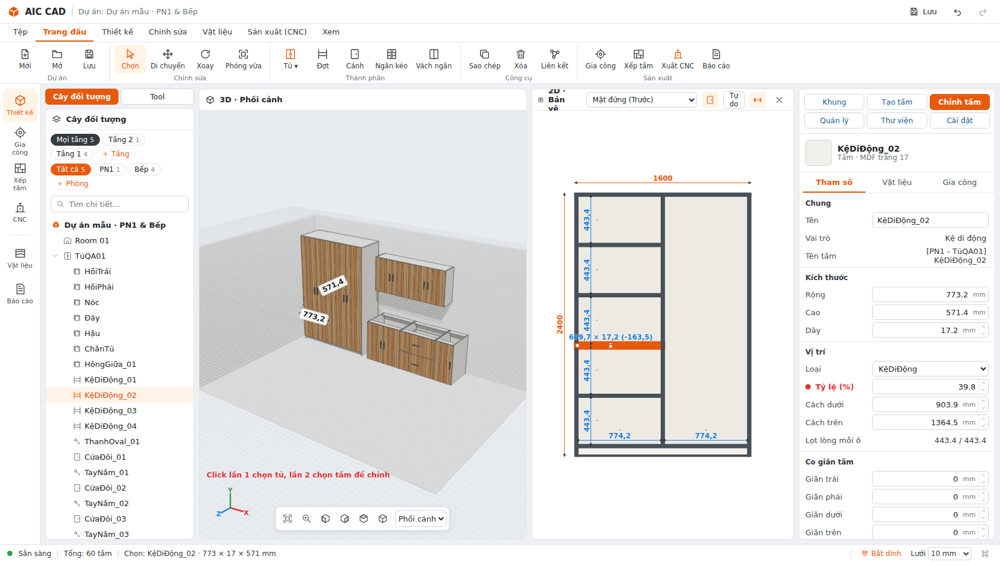

**Quan hệ 2 tấm**: chọn tấm A, Ctrl+click tấm B → chuột phải (hoặc Tool 23):

| Lựa chọn | Kết quả |
|---|---|
| A phủ B | A chạy tới mặt ngoài B, B dừng ở A (ví dụ Đáy phủ Hồi: hồi đứng trên đáy). |
| A lọt B | A dừng ở mặt trong B, B chạy qua A. |
| Bằng mặt trước | Cạnh trước A bằng mặt cạnh trước B (ví dụ kệ không lùi). |
| Khe… | Như lọt, chừa khe g mm. |
| Bỏ quan hệ | Xóa ràng buộc giữa A và B. |

Quan hệ lưu thành ràng buộc nên đổi kích thước tủ vẫn giữ.

**Kéo 4 cạnh tấm**: chọn một tấm của tủ, ở Mặt đứng xuất hiện 4 ô vuông cam ở giữa các cạnh. Kéo để xem trước
kích thước mới (Shift: bước 10 mm), thả chuột để lưu. Nút trên thanh bản vẽ đổi chế độ:
- **Giữ ràng buộc**: cạnh đang bám mặt tấm khác chỉ đổi khe tới mặt đó.
- **Tự do**: bỏ ràng buộc của cạnh đó và đổi offset của tấm.

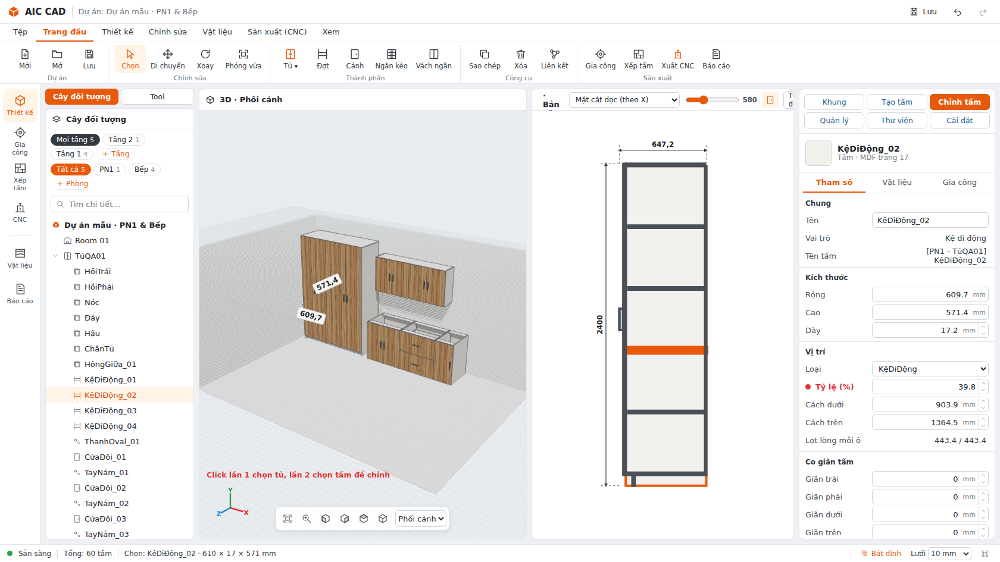

**View**: Mặt đứng (Trước), Mặt bên (Trái), Mặt bên (Phải), Mặt bằng (Trên), **Mặt cắt dọc (theo X)** và **Mặt cắt
ngang (theo cao)**. Với mặt cắt, kéo thanh trượt để chọn vị trí cắt (số mm hiện bên cạnh); tấm bị cắt tô gạch chéo,
phần phía trước mặt cắt được bỏ đi.

## 4e. Sửa kích thước, chế độ dãn khoang
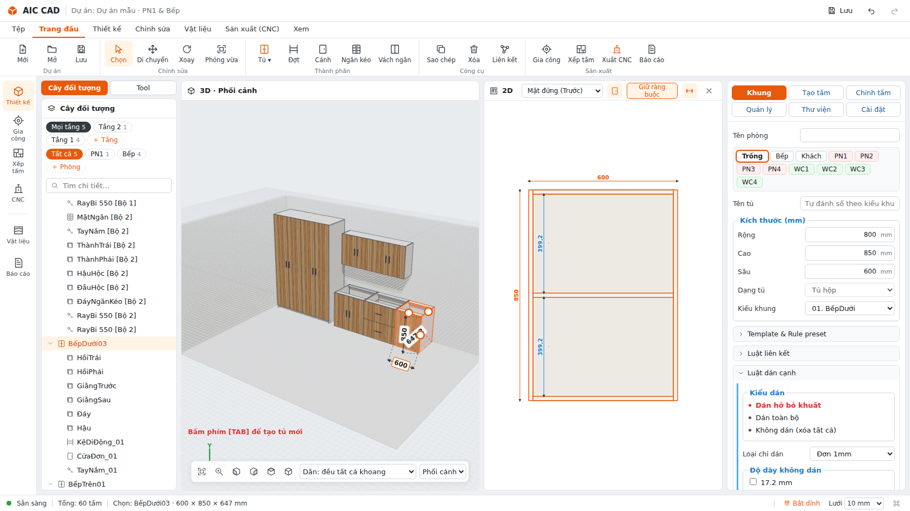

- Chọn 1 tủ: bấm vào **số kích thước trong 3D** (rộng / cao / sâu) hoặc số W/H màu cam trên 2D, nhập số, Enter.
  Kéo chấm tròn cam trong 3D cũng được.
- Ô **Dãn** trên thanh công cụ 3D quyết định phần thêm/bớt chia vào khoang thế nào:
  - **Dãn đều tất cả khoang**: mọi khoang giữ tỷ lệ cũ (600 | 948 → rộng thêm 200 thì cả hai cùng tăng theo tỷ lệ).
  - **Chỉ khoang sát cạnh kéo**: chỉ khoang ở phía đang kéo tăng/giảm, các khoang khác giữ nguyên mm.
  - **Giữ KHÓA/%/AUTO**: theo chế độ từng khoang đã đặt.
  Kệ, cánh, ngăn kéo (cả chiều cao từng ngăn khi đổi chiều cao) tự dãn theo khoang — không phải chỉnh tay.
- Tủ đứng liền trong cùng dãy tự dịch theo.

**Nhập số khi kéo** (tay kéo W/H/D 3D, kéo vách/kệ, đường chia ngăn kéo, cạnh tấm trên 2D):
- Đang giữ chuột kéo mà gõ số → dùng đúng số đó (nhãn hiện `1800▌ mm`).
- Thả chuột → ô nhập mở ngay tại chỗ, điền sẵn giá trị vừa kéo; gõ số chính xác rồi **Enter** (hoặc bấm ra
  ngoài) để áp, **Esc** để hủy. Kéo vách/kệ: số là khoảng trống của khoang phía trước/dưới tấm; kéo cạnh tấm: số là
  kích thước mới của tấm.

## 4f. Thuộc tính kết cấu và mẫu dùng lại
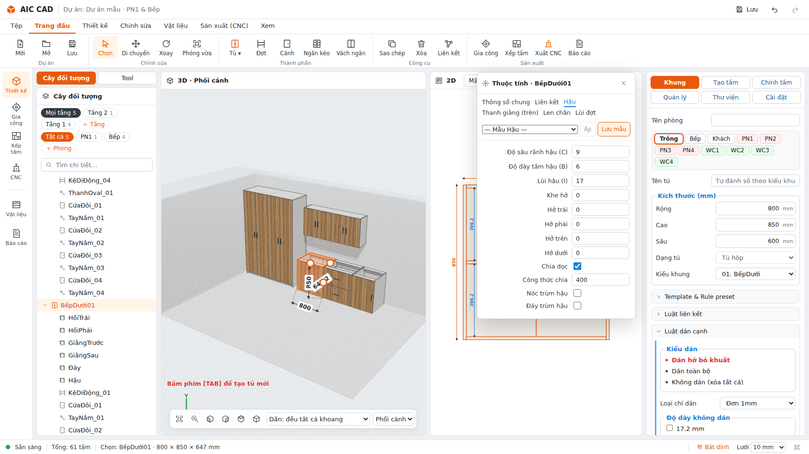 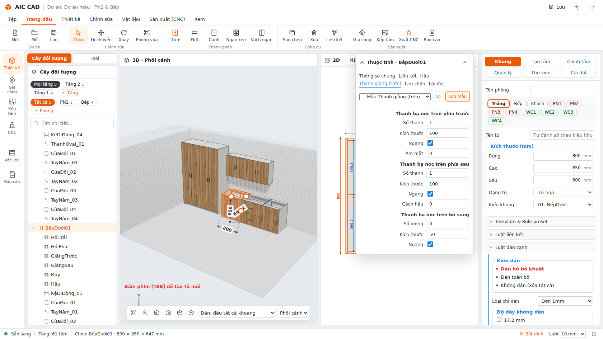

Chuột phải tủ → **Thuộc tính kết cấu**. Các tab:

| Tab | Tùy chọn |
|---|---|
| Thông số chung | Rộng, cao, sâu, dày ván |
| Liên kết | Nóc phủ / lọt / thanh giằng, đáy phủ / lọt, có tấm hậu |
| Hậu | Độ sâu rãnh (C), dày hậu (B), lùi hậu (I), khe hở (hậu vào rãnh = C − khe), hở trái/phải/trên/dưới, chia dọc + công thức chia (`600` = mỗi tấm ≤ 600 mm, `3x` = chia 3), nóc trùm hậu, đáy trùm hậu |
| Thanh giằng (trên) | Phía trước: số thanh, kích thước, ngang/đứng, âm mặt · Phía sau: số thanh, kích thước, ngang/đứng, cách hậu · Bổ sung: số lượng, kích thước, ngang (chia đều ở giữa). Dùng khi Nóc = Thanh giằng |
| Len chân | Cao chân, chân giật vào |
| Lùi đợt | Kệ di động lùi trước |

**Lưu mẫu**: mỗi tab có ô chọn mẫu + nút **Lưu mẫu** / **Áp** (chọn nhiều tủ rồi Áp để áp cho cả nhóm).
Mẫu lưu vào **thư viện dùng chung mọi dự án** (file `~/.aic-cad/library.json`, đổi bằng biến `AIC_LIBRARY`).

Cũng lưu vào thư viện: **template tủ** (chuột phải tủ → Lưu làm template), **rule preset** (Cài đặt), và
**mẫu vùng** — chuột phải một vùng → *Lưu vùng này làm mẫu…*; ở tủ khác chuột phải vùng → mục *Mẫu vùng* → chọn
mẫu để dựng lại toàn bộ kệ, vách, cánh, ngăn kéo, thanh treo của vùng đó (tự co theo kích thước vùng mới).

## 4g. Di chuyển khối, bắt dính khi co kéo

- **Kéo trực tiếp**: chọn tủ (hoặc nhiều tủ), bấm giữ lên thân tủ trong 3D và kéo — tủ trượt trên mặt sàn, tự bắt dính
  vào tủ/tường gần. Đang kéo gõ số (mm) + **Enter** để dời đúng khoảng đó theo trục đang kéo (X hoặc Z). **Esc** hủy.
  Thả chuột là một bước undo.
- Cách khác: công cụ **Di chuyển (M)** với tay nắm trục, hoặc nhập X/Y/Z ở tab **Chỉnh tấm**.
- **Bắt dính khi co kéo**: kéo tay nắm kích thước tủ (3D) hoặc cạnh tấm (2D) sẽ dừng ở cạnh hộp của tủ/chi tiết
  khác trong khoảng 10 px, có đường gạch cam chỉ điểm bắt. Giữ **Alt** để kéo tự do.

## 4h. Chia khoang theo công thức (giống Chia ngang / Chia dọc của plugin)

- Mở: nút **Chia khoang** (Trang đầu → Thành phần), phím **K**, hoặc chuột phải khoang → *Chia ngang/dọc theo công thức…*
- Chọn tủ, rồi **bấm vào khoang** trong 3D hoặc trên bản vẽ 2D. Hộp thoại giữ nguyên để chia tiếp; **Esc** đóng.
- **Công thức chia**: `500` = khoang 500 (KHÓA) + phần còn lại (AUTO) · `500,300` · `30%,*` · `3*400` · `/3` chia đều 3.
- **Trên xuống dưới** (ngang) / **Phải sang trái** (dọc): tính công thức từ phía nào.
- **Tạo tấm = Không**: chỉ tách khoang (đường nét đứt trên 2D), không sinh tấm — để gắn cánh / ngăn kéo cho từng phần.
- **Đợt di động**: kệ di động (có chốt) thay vì kệ cố định.
- Bỏ chia: chuột phải khoang → **Gộp với khoang kế bên**. Mỗi lần chia là một bước undo.

## 4i. Chuẩn xưởng (các thông số sản xuất không còn viết cứng)

Chuột phải tủ → **Thuộc tính kết cấu**. Các tab mới:
- **Kệ & chốt tầng**: lùi kệ, hở kệ mỗi bên, lỗ chốt *chỉ tại vị trí kệ* hoặc **hàng lỗ hệ 32** (bước, lỗ đầu/cuối
  cách đáy/nóc khoang, cách mép trước/sau, Ø, sâu).
- **Cánh & tay nắm**: bảng số bản lề theo cao cánh (`900=2, 1600=3, 4`), tâm chén cách mép, chén đầu cách đầu cánh,
  Ø/sâu chén; tay nắm dài, vị trí (**theo loại tủ**: bếp dưới/ngăn kéo → trên, bếp trên → dưới), cách đầu cánh;
  chồng cánh lùa. **Loại tay nắm**: thanh / núm / nhấn mở (push-open: 1 bộ mỗi cánh ≤ 1200, 2 bộ nếu cao hơn) /
  không tay nắm; **Khoan lỗ tay nắm** (xuyên cánh theo bước lỗ); **Khoan đế bản lề trên hồi** (2 lỗ Ø5 cách mép trước 37, bước 32).
- **Ngăn kéo**: **loại ray** (ray bi 3 tầng / ray âm giảm chấn: hở hông 5, hộc ngắn hơn ray 10, đáy nâng 12 / hộp kim loại
  tandem: chỉ cắt đáy LW−75 và hậu hộc LW−87), hộc thấp hơn ô, đáy hộc cách đáy ô, cao hộc tối thiểu/tối đa (ngăn nồi > 250), ray ngắn hơn sâu khoang.

- **Liên kết** (tab Liên kết): kiểu liên kết thùng **chốt gỗ / cam (minifix) + chốt gỗ / vít xuyên / ke góc**, lỗ đầu cách mép,
  khoảng cách tối đa, Ø và độ sâu chốt, cam (Ø15, sâu 12.5, tâm cách mặt hồi 34), lỗ chốt cam trên cạnh. Lỗ khoan sinh thật
  trên tấm (xem ở Sản xuất → Gia công), báo giá đếm riêng Chốt gỗ / Cam / Vít liên kết / Ke góc.

- **Chân / treo** (tab thay cho Len chân): kiểu chân *theo loại tủ / không chân / len chân trước / len 3 mặt (trước + 2 hông,
  cho tủ đầu dãy, dùng khi đáy phủ hồi) / chân nhựa tăng chỉnh (hồi đứng trên chân; 4/6/8 chân theo rộng) / chân nhựa + len kẹp /
  tủ treo (2 ke treo + thanh treo tường 17 × 60 tùy chọn)*. Báo giá có chân nhựa, ke treo.

- **Dán cạnh** (theo nhóm tấm): cánh / mặt ngăn kéo, thùng, kệ, hậu, hộc — mỗi nhóm chọn *theo luật chung / dán hở bỏ khuất /
  dán toàn bộ / không dán* và loại chỉ (Đơn 0.5/1/2, Kép 1, ABS 1/2, PVC 1). Hậu và đáy hộc mặc định không dán theo vai trò
  (không phụ thuộc độ dày). Kích thước cắt trừ đúng độ dày chỉ từng cạnh; báo giá tách mét chỉ theo mã.

Dòng **Bộ vật liệu** (dưới Chuẩn xưởng): chọn bộ dựng sẵn — *Bếp chống ẩm (MFC lõi xanh + Acrylic)*, *Tủ áo MFC vân sồi*,
*Cao cấp Veneer tần bì*, *Tiết kiệm MDF trắng* — hoặc bộ tự lưu; **Áp** cho tủ đang chọn, **Cả phòng** cho mọi tủ cùng phòng
(vật liệu thùng / cánh / hậu + chỉ dán cánh, thùng, kệ; một undo); **Lưu bộ** lấy từ tủ đang mở. Thư viện vật liệu có thêm MFC
(khổ 1830 × 2440), MFC lõi xanh chống ẩm, Acrylic, Laminate, Veneer, HDF lõi xanh (dự án cũ tự có khi mở).

Dòng **Chuẩn xưởng** trên cùng: **Lưu chuẩn** lưu mọi tab của tủ này (trừ Rộng/Cao/Sâu) vào thư viện dùng chung;
chọn chuẩn → **Áp** cho tủ đang chọn (chọn nhiều tủ để áp cùng lúc). Mỗi lần áp là một bước undo.
Tủ cũ giữ nguyên thông số như trước (mặc định = giá trị cũ).

Khi bật **Hàng lỗ hệ 32** + **Kéo kệ bắt vào lỗ**: mọi kệ di động (thêm mới, kéo, nhập số, chia khoang) tự nằm
trên lỗ gần nhất (lệch tối đa nửa bước lỗ), nên kích thước khoang hiển thị là kích thước thật khi lắp.

## 4j. Dãy tủ: mặt đá, len chân liền, tấm lấp, che trần

- Chọn các tủ liền nhau (Ctrl+click) → chuột phải → **Tạo dãy tủ**. Mặc định có **mặt đá** 20 mm phủ cả dãy, nhô trước 20.
- Bảng **Dãy tủ**: vật liệu mặt (đá thạch anh trắng / granite đen…), dày, nhô trước / trái / phải; **len chân liền cả dãy**
  (tủ trong dãy tự bỏ len riêng); **tấm lấp** trái / phải (mm); **cao độ trần** → tấm che trần từ đỉnh dãy lên trần.
- Đổi rộng / cao / sâu hay dời tủ trong dãy: mặt đá, len chân, tấm lấp **tự sinh lại** trong cùng một bước undo.
- **Tủ góc L mù**: Trang đầu → **Tủ ▾ → Tủ góc L mù (góc trái / góc phải)**. Tủ 1100 có **tấm mù** cố định phía góc (không
  bản lề, không tay nắm) và **1 cánh 450** phía ngoài, mở ra phía ngoài góc. Chọn sẵn một tủ thì tủ góc đặt liền bên phải,
  cùng phòng / tầng. Có thể sửa rộng tủ, kéo đường chia giữa tấm mù và cánh trên 2D như khoang thường.
- Chuột phải tủ → **Dãy tủ của tủ này…** để mở lại bảng; **Xóa dãy** bỏ các tấm dãy và trả lại len chân riêng.

## 5. Tool (tab Tool bên trái)
Chọn tấm rồi chọn tool. Các tool đã dùng được:

| Tool | Cách dùng |
|---|---|
| 01 Xóa | Xóa tấm đang chọn (hoàn tác được). |
| 02 Ẩn/Hiện | Ẩn hoặc hiện tấm. |
| 03 Khấu góc | Khoét góc xuyên tấm. |
| 04 Cắt tự do | Cắt xiên một góc (nhập 2 khoảng cách) hoặc cắt theo đường qua 2 điểm; chọn giữ phần lớn / trái / phải. |
| 06 Hợp tấm | Ctrl+click ≥ 2 tấm cùng mặt phẳng, cùng độ dày, chạm nhau → gộp vào tấm chọn đầu. |
| 08 Khấu bề mặt | Khoét một phần bề mặt. |
| 09 Cắt theo tấm | Lấy một tấm làm "tấm cắt", chọn các tấm bị cắt, khe hở mỗi phía. Xuyên ở mép → đổi biên dạng; xuyên giữa → khoét lỗ; không xuyên hết → khấu mặt. |
| 10 Bo/Vác góc | Chọn góc trên sơ đồ, bo tròn R hoặc vát C. Có nút "Bỏ hình dạng". |
| 11 Co giãn | Chọn cạnh → nhập mm → Enter. Cộng dồn, ± để bù thêm, có nút bỏ co giãn. |
| 12 Tạo rãnh | Đặt rãnh hậu của tủ. |
| 13 Đảo phủ/lọt | Đổi cánh hoặc ngăn kéo giữa phủ bì và lọt lòng. |
| 14 Ghép bề dày | Nhân độ dày theo số lớp (2 lớp 17.2 → 34.4); "Bỏ ghép" về độ dày gốc. |
| 16 Rãnh LED | Tạo rãnh LED. |
| 17 | Mở phần Ngăn kéo. |
| 18 Vbit | Rãnh V-bit. |
| 19 Xóa tool cả tủ | Xóa mọi gia công đã thêm của tủ. |
| 20 Chia tấm | Chia một tấm (hậu, cánh…) thành 2–50 tấm theo chiều cao hoặc rộng, có khe; tự cập nhật khi đổi kích thước tủ. |
| 21 Cung cạnh | Chọn cạnh, cung lõm (khoét vào) hoặc lồi (phình ra), độ cong mm. |
| 22 Biên dạng tự do | Click trên sơ đồ tấm để đặt điểm (bắt 5 mm, Shift 1 mm) hoặc nhập X/Y; chọn Cắt bỏ vùng / Khoét lỗ xuyên / Thay cả biên dạng. Đa giác tự cắt bị từ chối. |
| 23 Quan hệ 2 tấm | Như menu chuột phải: phủ / lọt / bằng mặt / khe / bỏ. |

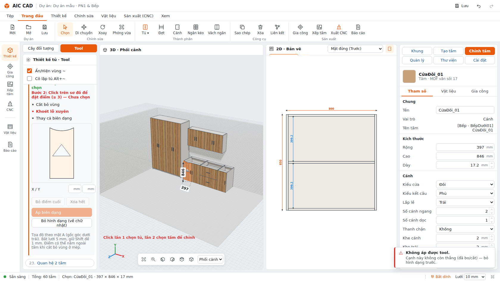

Các tool ghi "Sắp có" chưa làm.

## 6. Báo cáo
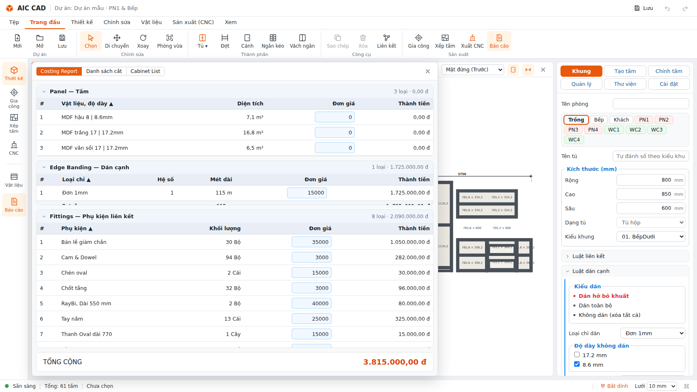

Mở bằng nút **Báo cáo** trên ribbon. Báo cáo gồm:
- **Costing Report**:
  - m² ván theo vật liệu và độ dày.
  - Mét chỉ dán cạnh.
  - Phụ kiện: bản lề, chốt tầng, ray bi, tay nắm, cam & dowel, thanh oval.
  - Đơn giá sửa được; Ctrl+Z hoàn tác.
  - TỔNG CỘNG.
- **Danh sách cắt** (xuất CSV): tên dạng `[Phòng - Tủ] Tấm`, kích thước cắt, mã chỉ cạnh.
- **Cabinet List**: danh sách tủ theo phòng.

### Báo giá, danh sách cắt gộp, nhãn tấm
- Tab **Báo giá**: theo tầng · phòng; mỗi tủ chọn *theo loại tủ* (bếp dưới / trên / ngăn kéo → **mét dài**; tủ áo, kệ… →
  **m² mặt đứng**), **bóc chi tiết** (vật tư × (1 + hao hụt) × (1 + công)). Sửa đơn giá mét dài / m² ngay trên dòng, hao hụt,
  công, lợi nhuận, VAT ở đầu bảng (lưu trong dự án, có undo).
- **In báo giá / Lưu PDF**: nhập đơn vị báo giá (tự nhớ), khách hàng, điện thoại, công trình, ghi chú → trang A4 có bảng theo
  phòng, tổng + VAT, **tổng bằng chữ**, chỗ ký. Trong hộp thoại in chọn "Lưu dưới dạng PDF" để ra tệp PDF.
- Tab **Danh sách cắt**: cột **Mã tấm** (phòng-tủ-số); **Gộp tấm giống nhau** (cùng vật liệu, kích thước cắt, dán cạnh, gia
  công) → SL gộp + danh sách mã; **Excel / CSV** xuất theo chế độ đang xem; **In nhãn** 60 × 40 mm (mã, tên, kích thước cắt,
  vật liệu, ký hiệu cạnh dán) — in từ trình duyệt ra A4.

## 7. Sản xuất
Thanh bên trái có các mục sau:
- **Gia công**: bản vẽ trải phẳng mặt A/B.
- **Xếp tấm**: nesting.
- **CNC**: đường chạy dao, mô phỏng, xuất G-code.

---

### Phím tắt hay dùng
| Phím | Việc |
|---|---|
| TAB | Tạo tủ (tab Khung) / Thêm tấm (tab Tạo tấm) |
| ~ | Bật/tắt hiện vùng |
| Alt+~ | Cô lập tủ đang chọn |
| Ctrl+click | Ghim thêm vùng / chọn thêm |
| Chuột phải | Dựng nhanh (vùng) / thao tác nhanh (tấm) |
| Ctrl+Z / Ctrl+Y | Hoàn tác / làm lại |
